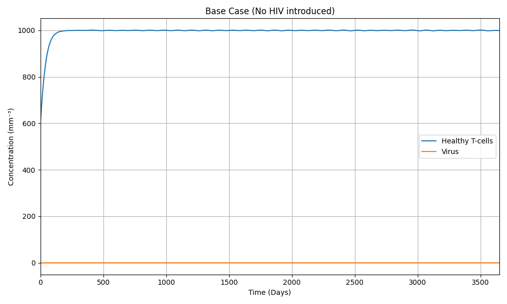
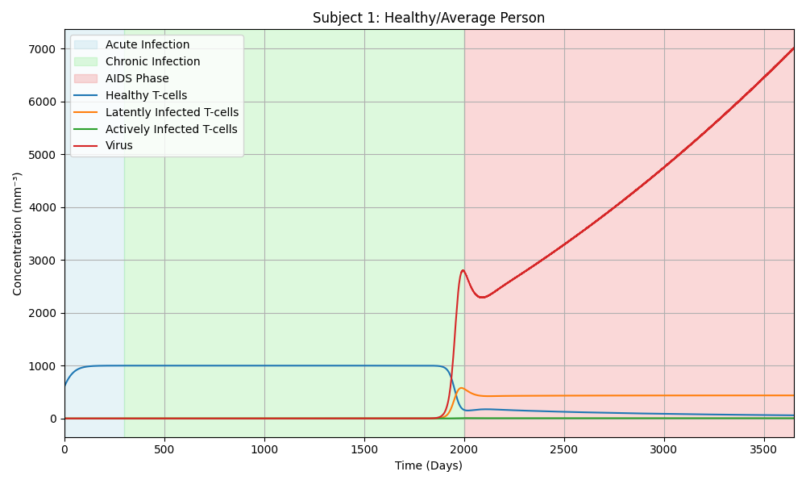
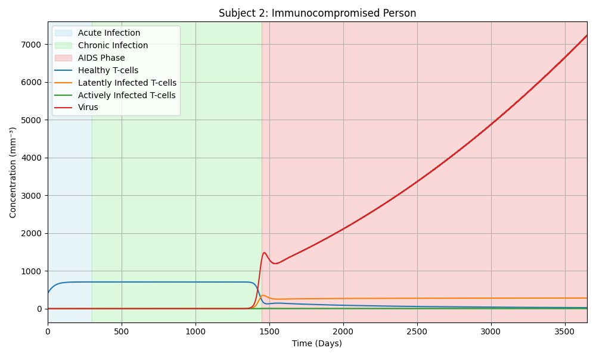
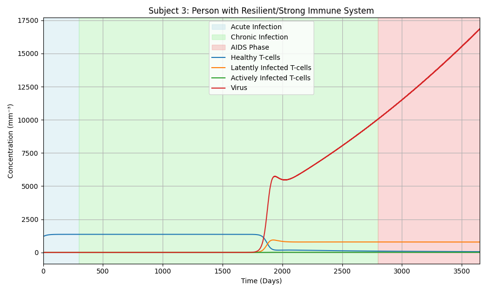

# Modeling the progression of HIV to AIDS in an individual

## Figure 0: Base Case (No HIV introduced)

## Figure 1: Average Healthy Individual

## Figure 2: Immunocompromised Individual

## Figure 3: Individual with Strong Immune System

